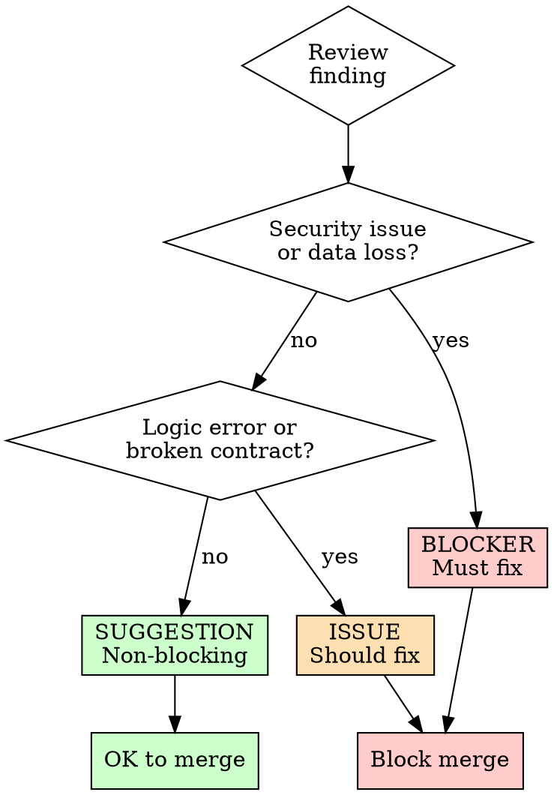

# Skill: Code Review

## Purpose
Structured code review workflow that catches bugs, maintains code quality, and prevents regressions before changes are committed.

## Trigger
- Before committing a set of changes
- When the user asks for a review
- After completing a change plan's execution
- When validating someone else's code

## Workflow

### Step 1: Understand the Intent

Before reading code, understand what the change is supposed to do:
1. Read `active/change_plan.md` (if it exists) -- what was the goal?
2. Read `active/active_issue.md` (if it exists) -- what problem does this solve?
3. If neither exists, ask the user for a one-sentence summary of the change's purpose

### Step 2: Enumerate Changes

List every file that was modified, created, or deleted:
- Use `git diff --name-status` or equivalent
- Group by type: modified, added, deleted
- Note which files are tests vs. source vs. config

### Step 3: Review Each File

For each changed file, check:

#### Correctness
- Does the change do what the intent says it should?
- Are edge cases handled? (null, empty, boundary values)
- Are error paths handled? (what happens when things fail?)
- Is the logic correct? (trace through mentally with sample inputs)

#### Safety
- No hardcoded secrets, API keys, or credentials
- No SQL injection, XSS, or command injection vectors
- No unsafe deserialization or path traversal
- Input validation at system boundaries

#### Consistency
- Does it follow existing code patterns in the file/project?
- Naming conventions match (casing, prefixes, suffixes)
- Error handling matches the project's pattern
- Import style matches

#### Dependencies
- Are new dependencies justified?
- Do changed function signatures break callers?
- Are type contracts maintained?
- Do changed exports break importers?

#### Tests
- Are there tests for the new/changed behavior?
- Do existing tests need updating?
- Are edge cases tested?
- Are error paths tested?

### Step 4: Check for Regressions

1. Read `active/regression_checklist.md`
2. For each entry: does this change affect that sensitive area?
3. If yes: has the verification step been run?
4. Check what imports/calls the changed code -- are those paths still correct?

### Step 5: Summarize Findings

Write findings in one of these categories:

| Category | Meaning | Action |
|----------|---------|--------|
| **Blocker** | Bug, security issue, or data loss risk | Must fix before merging |
| **Issue** | Logic error, missing edge case, broken contract | Should fix before merging |
| **Suggestion** | Style improvement, minor optimization | Fix or skip, not blocking |
| **Question** | Something unclear that needs explanation | Clarify, may reveal a bug |
| **Positive** | Something well done | Note for reinforcement |

### Step 6: Report

Present findings to the user organized by category, with:
- File and line reference for each finding
- What the problem is (be specific)
- Suggested fix (if you have one)
- Severity justification for blockers and issues

## Review Depth Levels

| Level | When to Use | Coverage |
|-------|------------|----------|
| **Quick** | Small changes, typo fixes, config updates | Scan for obvious issues only |
| **Standard** | Feature additions, bug fixes | Full workflow above |
| **Deep** | Security-sensitive, shared utilities, database changes | Standard + trace all callers/consumers |

## Anti-Patterns

- Reviewing without understanding intent -- you can't judge correctness without knowing the goal
- Only checking the happy path -- bugs live in edge cases
- Style-only feedback on critical changes -- focus on correctness first
- Approving because "it looks fine" -- trace the logic, don't skim
- Reviewing too much at once -- review in focused chunks, not 20-file diffs
