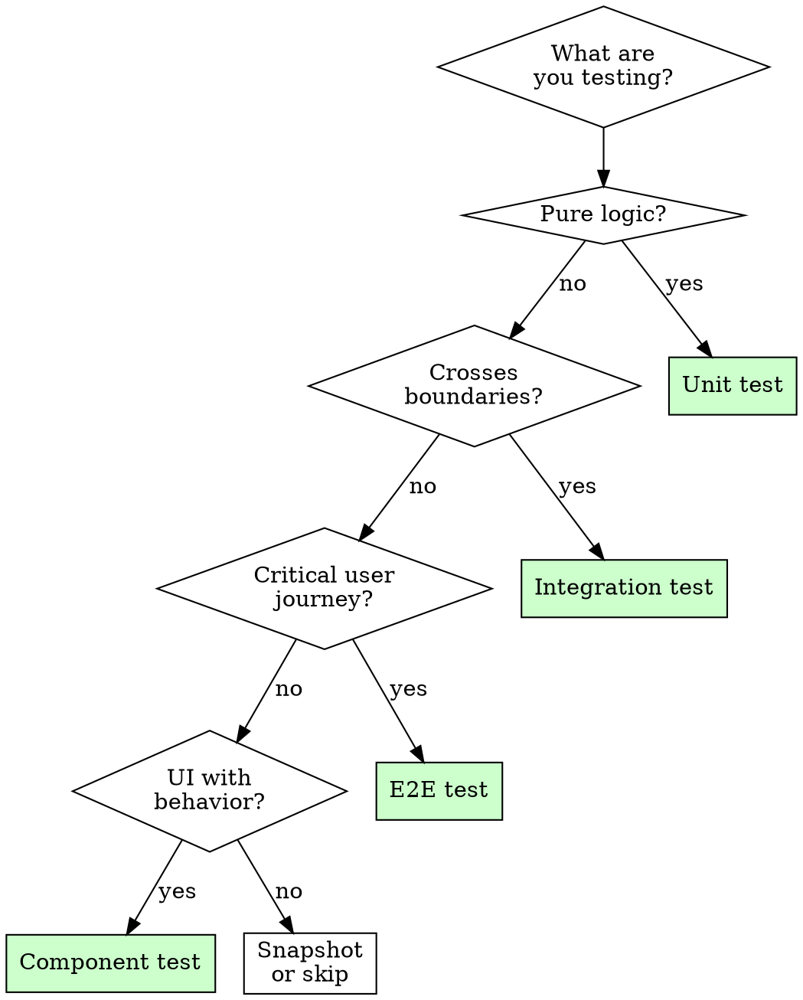

# Skill: Testing Strategy

## Purpose
Guide test planning and execution: what to test, what type of test to write, how to structure tests, and how to evaluate coverage meaningfully.

## Trigger
- Writing tests for new code
- Evaluating test coverage after changes
- Planning test strategy for a feature
- Phase 14 of Modaf SaaS (polish)
- Validation plan execution

## Workflow

### Step 1: Identify What to Test

Not everything needs the same level of testing. Prioritize by risk:

| Risk Level | What | Testing Approach |
|-----------|------|-----------------|
| **Critical** | Auth, payments, data mutations, permissions | Unit + integration + e2e |
| **High** | Business logic, state transitions, API contracts | Unit + integration |
| **Medium** | UI components with logic, form validation | Unit + component tests |
| **Low** | Static UI, formatting, simple getters | Snapshot or skip |

### Step 2: Choose Test Type

| Test Type | When to Use | Speed | Confidence |
|-----------|------------|-------|------------|
| **Unit** | Pure functions, utilities, business logic | Fast | High for logic |
| **Integration** | API routes, database operations, component interactions | Medium | High for contracts |
| **E2E** | Critical user flows (login, checkout, core actions) | Slow | Highest for UX |
| **Component** | UI components with state or logic | Fast | Medium |
| **Snapshot** | UI regression detection | Fast | Low (fragile) |

**Decision tree**:



### Step 3: Write the Test

#### Test Structure (Arrange-Act-Assert)
```
1. Arrange: Set up the preconditions
2. Act: Execute the thing being tested
3. Assert: Verify the outcome
```

#### Naming Convention
```
describe('[unit under test]', () => {
  it('should [expected behavior] when [condition]', () => {
    // ...
  });
});
```

Good: `it('should return 401 when token is expired')`
Bad: `it('works')` / `it('test1')` / `it('should be correct')`

#### What Every Test Must Cover
1. **Happy path**: Normal expected behavior
2. **Edge cases**: Boundaries, empty inputs, max values
3. **Error cases**: Invalid inputs, network failures, missing data
4. **State transitions**: Before/after for stateful operations

### Step 4: Evaluate Coverage

Coverage is a metric, not a goal. Focus on:

| Metric | What It Means | Target |
|--------|-------------|--------|
| **Line coverage** | Code lines executed | > 80% for critical paths |
| **Branch coverage** | Decision paths taken | > 70% for business logic |
| **Mutation testing** | Tests catch real bugs | When available, use |

**What coverage doesn't tell you**:
- Whether the right things are tested
- Whether edge cases are covered
- Whether tests are maintainable

### Step 5: Integration with Melted Peak

- **Validation plan**: Tests are the primary verification mechanism. Write validation plan criteria as test expectations.
- **Regression checklist**: When a bug is fixed, add a test for it. The regression checklist entry should reference the test.
- **Change plan**: The test strategy should be part of the change plan (what tests to write, what existing tests to check).

## Test Anti-Patterns

| Anti-Pattern | Problem | Fix |
|-------------|---------|-----|
| Testing implementation details | Breaks when code is refactored | Test behavior, not internals |
| No test isolation | Tests depend on each other | Each test sets up its own state |
| Sleeping in tests | Slow, flaky | Use proper async/await or mocks |
| Testing the framework | Wasting effort | Trust the framework, test your logic |
| 100% coverage obsession | Diminishing returns | Focus on risk-based coverage |
| No test maintenance | Tests rot and get ignored | Treat test code like production code |

## When NOT to Test

- Trivial getters/setters with no logic
- Framework-provided functionality (the framework tests it)
- Configuration files (validate at runtime instead)
- One-time scripts that will be deleted
